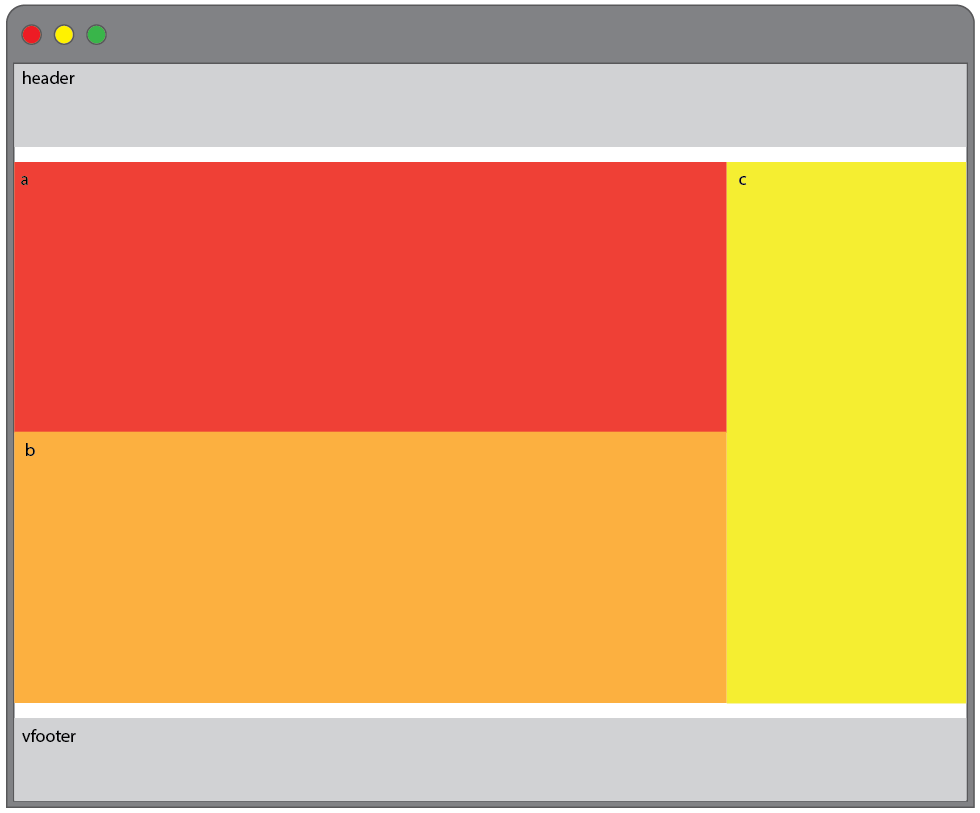
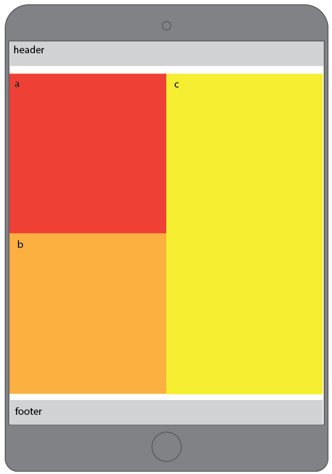
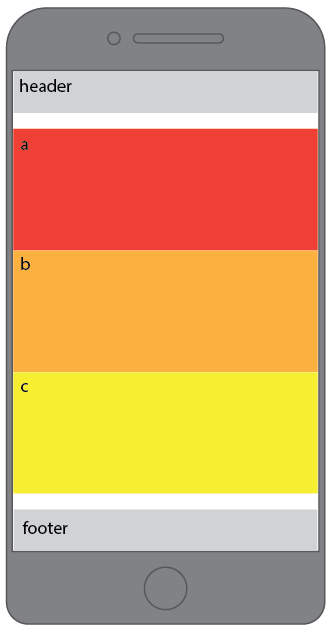
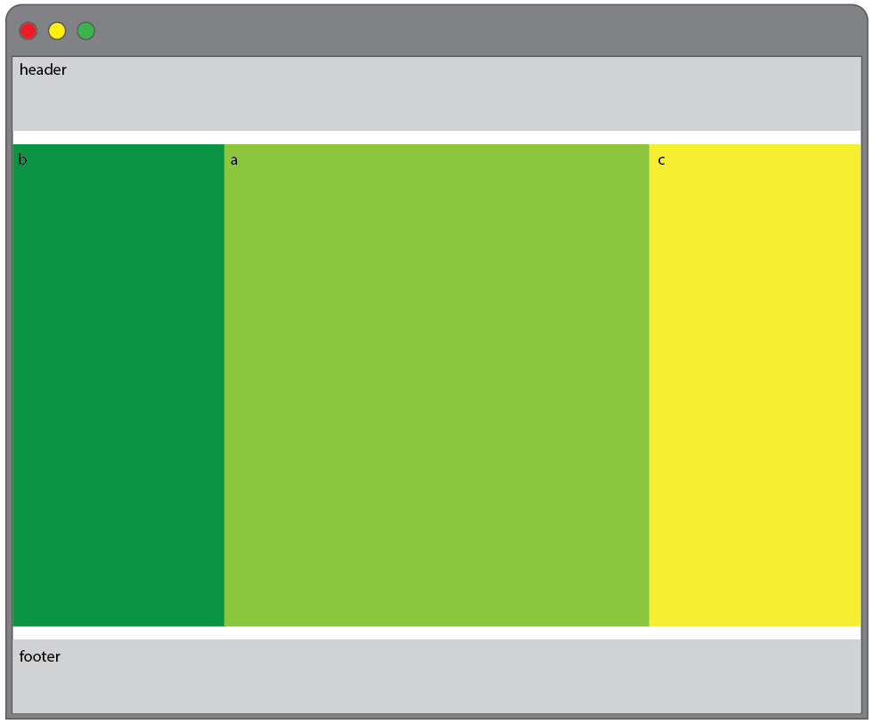
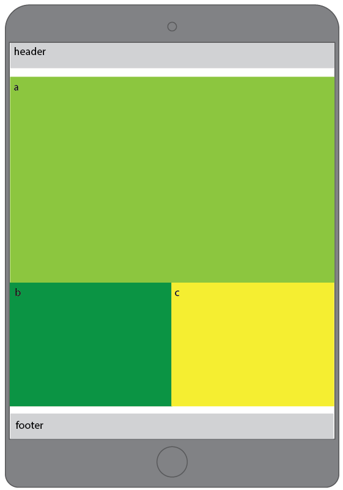
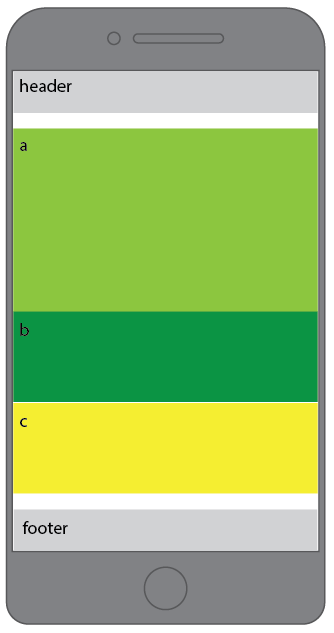

### Responsive Layout Challenge

As a front end developer, you will often be handed comps from a designer that you then have to build. You will need to be able to take a graphic file and recreate it with code. This means that you'll have to be able to think through how you're going to get all the elements in that comp where they need to be, and that requires a solid understanding of how to build responsive layouts.

### Getting Started

Set up the following directory and file structure:

* Make a new directory named "responsive-layout-challenge" and inside of it put:
* two html files
  - responsive-layout-a.html
  - responsive-layout-b.html
* two css files
  - responsive-styles-a.css
  - responsive-styles-b.css
* one reset file

In this exercise, we'll take a series of simple comps and recreate each locally. You will make the appropriate number of semantic tags with the correct numbers indicated in the comps, give them a `<height>`, `<width>`, and `background-color` and then make them match the layout in the comp. Here's an example of what this might look like in your HTML and CSS, without any positioning or breakpoints applied:

Your HTML (`div` tags are used for example only, use proper semantic tags):

```HTML
<div class="content-a">
  a
</div>

<div class="content-b">
  b
</div>
```
Your CSS:

```CSS
.content-a {
  background-color: black;
  height: 100px;
  width: 100px;
}

.content-b {
  background-color: gray;
  height: 100px;
  width: 100px;
}
```

### The Comps

Recreate the following comps using media queries to match the layouts on large, medium, and small screens,

##### Responsive Layout Challenge Set 1:








##### Responsive Layout Challenge Set 2:






